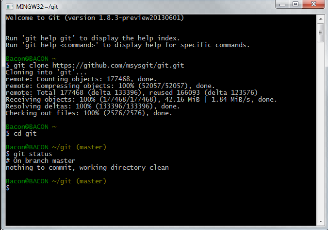
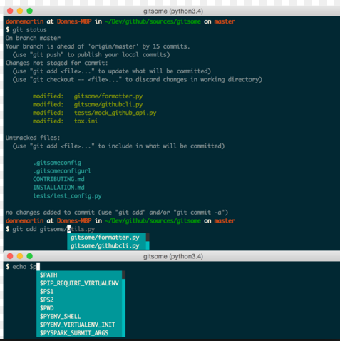

# project 2 : 여러 프로젝트 조사 및 경험  

#### 개요  

    여러 공개 자료, 프로젝트들을 수집, 조사 후 요약하여   
    앞으로 진행 할 프로젝트의 방향성을 세우는데 기틀을 마련하기 위한 프로젝트 입니다.

#### * 프로젝트를 시작하기 전에  

    프로젝트는 GitHub로 진행 할 예정입니다. 따라서, 우선 Git, GitHub가 무엇인지를 알고 가입 후 사용 방법을 익힙시다!
    
#### 1. Git, GitHub 정의  

https://www.zerocho.com/category/Git/post/58045dbc146be6001542a465  -블로그  
https://ko.wikipedia.org/wiki/%EA%B9%83%ED%97%88%EB%B8%8C  - WiKi  
https://github.com/tadkim/infra/wiki/GitHub-::-%EA%B9%83%ED%97%88%EB%B8%8C-%EC%82%AC%EC%9A%A9%EB%B2%95-1 - 

#### 2. GitHub 가입 방법  

https://github.com/hochan222/Search/blob/master/GitHub%20%EA%B0%80%EC%9E%85%EB%B0%A9%EB%B2%95.md  

#### 3. GitHub 사용 방법  
 
Git은 다음과 같이 기본적으로 bash나 cmd 창을 이용하지만 이번 프로젝트는 주어진 환경상 GitHub 웹으로 사용 범위를 제한합니다.    
  
  
  

https://github.com/hochan222/Search/blob/master/how_to_use_Git(Hub).md  - URL ㄱㄱ   

#### 4. Branch 방법  

#### 5. MarkDown Language  
 
GitHub에서는 MarkDown 언어를 주로 사용하므로 익혀두자.  

https://github.com/hochan222/Search/blob/master/MarkDown.md   

#### 6. 프로젝트 내의 폴더 설명

현황판 : 현재 전체 작업 현황을 나타낸 공간입니다.
의견 제시 : 작업을 하다가 생긴 의견들을 명세화 한 공간입니다. 의견은 시간 순으로 정렬 합니다.  
   
    호찬(17.10.10) - img/ dir 생성요청  Hochan dir 내에 img/ 생성완료  진혁 (17.10.11) - 조사범위 ~ 학교로 확대  의견 반영 완료 

각각 개인의 폴더가 주어졌으며 개인 폴더에서 작업을 하면 중간 중간에 최종 결과본으로 통합시킬 예정입니다. 
각각 개인 내부에는 
img/ : 개인적인 이미지 파일들을 저장하는 공간  
data/ : 조사한 모든 문서와 파일들을 data/ 폴더 내부에 저장한다.  
Note.md : 조사한 URL이나 메모하고 싶은 것을 적는 공간요약.  
ppt : 반드시 요약 ppt로 작업하되 일정 작업이 완전히 끝나면 최종 요약본으로 update 한다.  
공간들이 있습니다.  
필요에 따라 자신의 폴더 내부에 여러 폴더들을 생성 하면 됩니다. 
